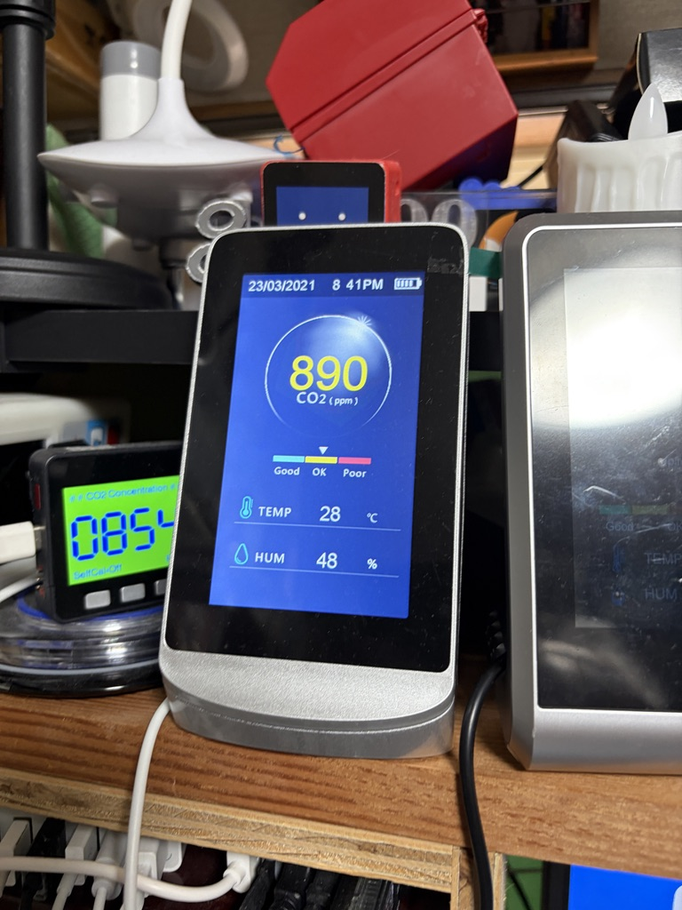
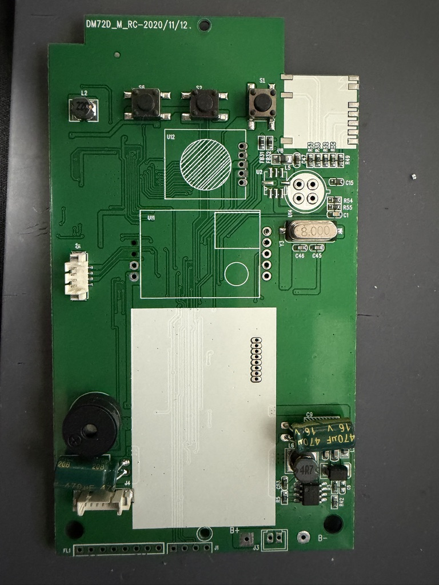
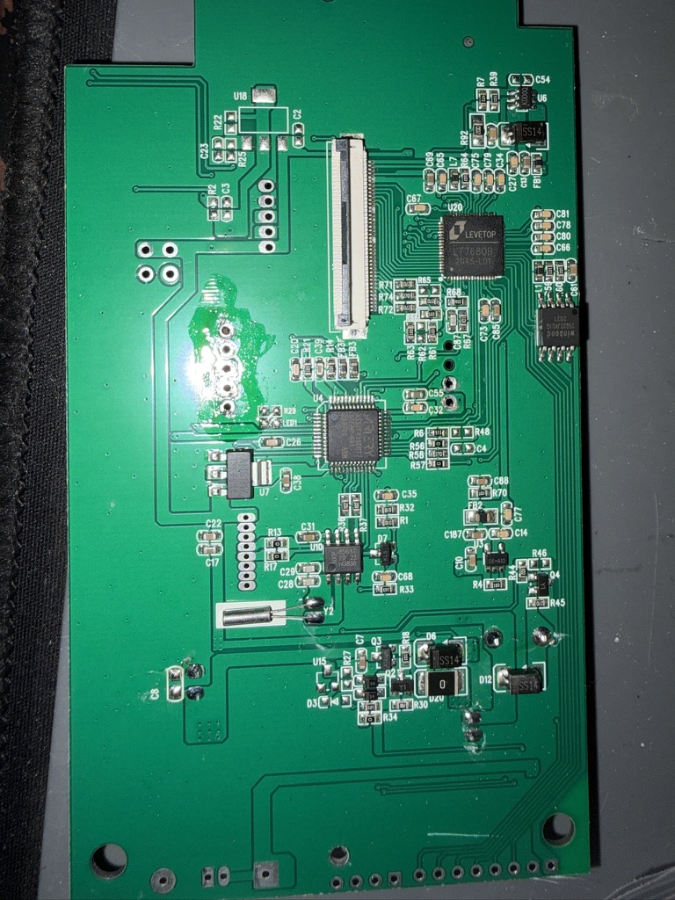

# CO2モニター（DM72C）の解析と自作ファームウェア

CO2モニターDM72Cの基板（シルク`DM72D_M_RC`、AT32F415CBT7＋LT7680B＋4.3インチ液晶480×272）を解析し、その上で動くソフトウェアを作成した。

| 元の製品 | DOOM タイトル | DOOM プレイ中 | ALIEN RAID |
|---|---|---|---|
|  |  |  |  |

| 基板（ボタン・J1側） | 基板（MCU・LT7680B側） |
|---|---|
|  |  |

## ドキュメント

| ファイル | 内容 |
|---|---|
| [doc/usage.md](doc/usage.md) | 使い方：電源、DOOM・ALIEN RAIDの操作、SET UP（時計合わせ）、快適度とHEALTH |
| [doc/debugger_connection.md](doc/debugger_connection.md) | デバッガ接続：RP2040-Zeroで作るデバッガ、J1の位置とピン、配線、接続確認 |
| [doc/flashing.md](doc/flashing.md) | 書き込み：電源とリセットの注意、書き込みコマンド |
| [doc/openocd_setup.md](doc/openocd_setup.md) | OpenOCD（ArteryTek版）の環境構築 |
| [doc/flash_backup.md](doc/flash_backup.md) | 工場ファームとW25Q32のバックアップ（`tools/backup_flash.py`） |
| [doc/board_analysis.md](doc/board_analysis.md) | 基板の解析：部品、ピン配置、電源、工場ファームから分かったこと |
| [software/colorbar_sample/README.md](software/colorbar_sample/README.md) | カラーバーサンプル：MCU–LT7680B配線、液晶設定 |
| [software/invaders/README.md](software/invaders/README.md) | ALIEN RAIDとW25Q32読み書きツール |
| [software/doomlike/README.md](software/doomlike/README.md) | DOOM：操作、描画方式、センサー、ホストシミュレータ |

## 構成

| フォルダ | 内容 |
|---|---|
| `doc/` | ドキュメント（上の表） |
| `img/` | 製品・基板・各ソフトウェアの写真 |
| `software/colorbar_sample/` | LT7680Bのカラーバー表示サンプル（最初の動作確認用） |
| `software/invaders/` | ALIEN RAID（8080エミュレータ上で動くインベーダー風ゲーム）とW25Q32読み書きツール |
| `software/doomlike/` | DOOM（LT7680Bの長方形塗りつぶしで描くDOOM風レイキャスター） |
| `tools/` | `backup_flash.py`：MCU内蔵FlashとW25Q32をSWDでバックアップする。`openocd.py`：OSに合ったOpenOCDを起動するラッパー |

工場ファームとW25Q32のダンプはメーカーの著作物のため、リポジトリに含めない（各自 `tools/backup_flash.py` で取得し、`analysis/factory_dump/` や `backups/` に置く。どちらも `.gitignore` で除外）。

## 要点

- MCU–LT7680B間はSPI2（PB12＝CS）。LT7680Bは水晶を持たず、PA8から8 MHzのクロックを受け取る
- PA7で電源をラッチしている。MCUがリセットされると電源が落ちる。工場ファームはWDTを使う
- 書き込みはSWD（J1）で行う。J1は基板下端の4ピン端子で、ボタンを上にして右からGND、SWDIO、SWCLK、3.3 V。接続は [doc/debugger_connection.md](doc/debugger_connection.md)、書き込みは [doc/flashing.md](doc/flashing.md)
- W25Q32（4 MB）はLT7680BのSPIマスター（nSS1）を経由してMCUから読み書きできる
