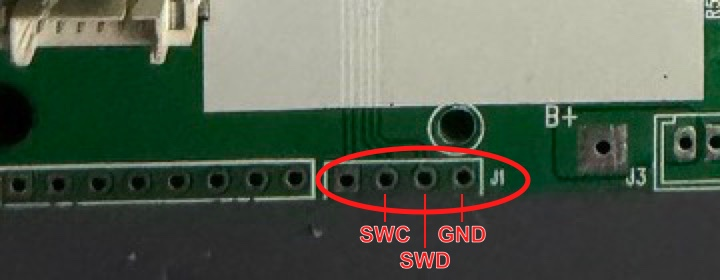
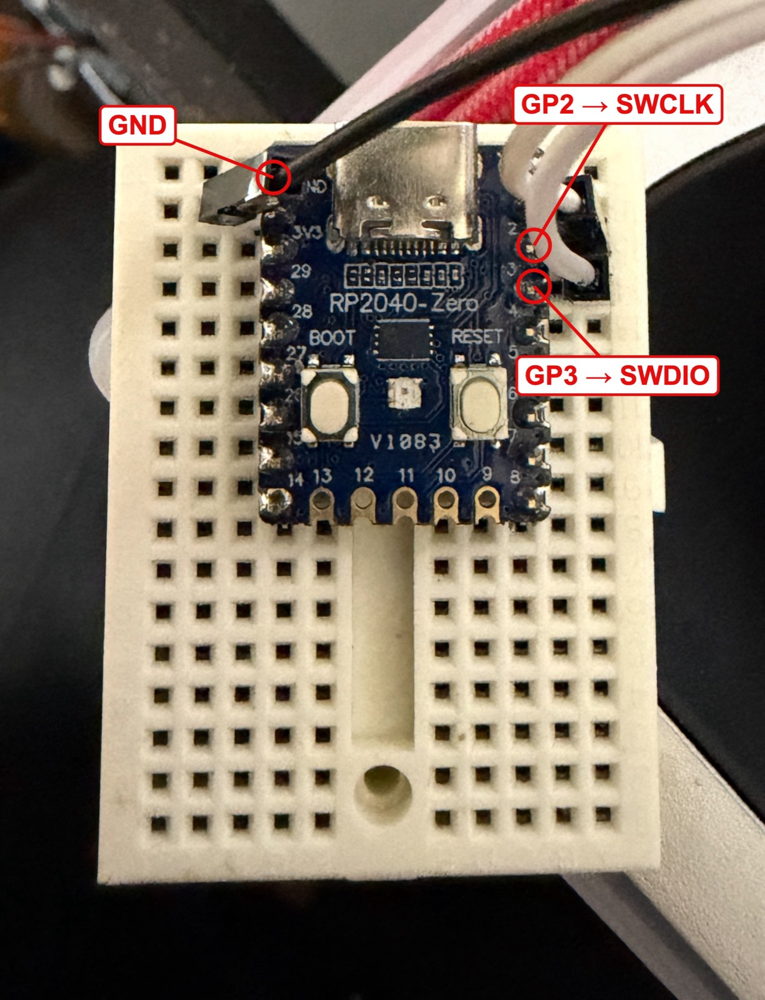

# デバッガ接続

デバッガ（RP2040-Zero）の作り方、J1との配線、接続確認をまとめる。書き込みは [flashing.md](flashing.md)、OpenOCDの導入は [openocd_setup.md](openocd_setup.md)、工場ファームのバックアップは [flash_backup.md](flash_backup.md) を参照。

## 必要なもの

- Waveshare RP2040-Zeroにdebugprobeファームを入れたデバッガ（作り方は下の「デバッガの作り方」）。CMSIS-DAPv2（VID:PID `2E8A:000C`）として認識され、macOSではドライバ不要
- ArteryTek版OpenOCD（`tool-openocd-at32`）とラッパー `tools/openocd.py`（[openocd_setup.md](openocd_setup.md)）

## J1の位置とピン

J1は基板のボタン側の面（[`../img/OMOTE.jpeg`](../img/OMOTE.jpeg)）の下端中央、シルク`J1`の左にある4穴。ボタンを上にして**右からGND、SWDIO、SWCLK、3.3 V**の順に並ぶ（右端がPin 4、左端がPin 1）。



| J1 Pin | 信号 | MCU側 |
|---:|---|---|
| 1（左端） | 3.3 V / VREF | VDD系 |
| 2 | SWCLK | PA14、MCU Pin 37 |
| 3 | SWDIO | PA13、MCU Pin 34 |
| 4（右端） | GND | VSS系 |

J1にはNRSTがないため、connect under resetはできない。PA15/JTDI、PB3/JTDO-SWO、PB4/NJTRSTも出ておらず、JTAGではなくSWD専用の端子。AT32F415ではSWDIO/SWCLKを別のピンへリマップできない。

## 配線

RP2040-ZeroとJ1を3本でつなぐ。RP2040-Zeroのピンはシルクの数字がGP番号。USBコネクタを上にして見る。



| RP2040-Zero | 位置（USBコネクタが上） | 信号 | J1 |
|---|---|---|---|
| GND | 左列の上から2番目（5Vの下） | GND | Pin 4（右端） |
| GP2（シルク`2`） | 右列の上から3番目 | SWCLK | Pin 2 |
| GP3（シルク`3`） | 右列の上から4番目 | SWDIO | Pin 3 |
| 3V3 | 左列の上から3番目 | — | 接続しない（Pin 1は空き） |

- J1の3.3 Vはつながない。デバッガから基板に給電しない
- 配線は短くし、GNDを確実にする。必要ならSWCLK/SWDIOに直列100 Ω程度を入れる
- Raspberry Pi Pico（GP2/GP3/GND、同じファーム）や製品版Raspberry Pi Debug Probe（`D`端子の橙SC→Pin 2、黄SD→Pin 3、黒GND→Pin 4）でも同じようにつなげる

## デバッガの作り方

RP2040-ZeroにRaspberry Pi公式のdebugprobeファーム（Pico用）を書き込むと、CMSIS-DAPのデバッガになる。ピン割り当てはPicoと同じ。

1. https://github.com/raspberrypi/debugprobe/releases から最新の **`debugprobe_on_pico.uf2`** をダウンロードする。`debugprobe.uf2` は製品版Debug Probe用なので使わない
2. RP2040-ZeroのBOOTボタンを押したままUSB-CでPCにつなぐ（つないだ状態なら、BOOTを押したままRESETを押して離す）。`RPI-RP2` というドライブが現れる
3. `debugprobe_on_pico.uf2` を `RPI-RP2` にコピーする。コピーが終わると自動で再起動し、ドライブが消える
4. USBに `Debugprobe on Pico (CMSIS-DAP)`（VID:PID `2E8A:000C`）が現れれば完成。macOSでは次で確認できる

```sh
system_profiler SPUSBDataType | grep -i -A6 debugprobe
```

あとは「配線」の表のとおりGP2、GP3、GNDをJ1につなぐ。GP4/GP5はUART（TX/RX）だが、この基板では使わない。

## 接続確認

基板の電源は**PWRボタンを1秒押して**入れる。自作ファームの動作中（LT7680Bと液晶が動いている間）は、DPは見えるがメモリアクセスが失敗するので、**PWRを押したまま**接続する。デバッガから給電しない。

リポジトリのルートで実行する。`reset` を含むコマンドはMCUのリセットで電源が落ちるので使わない（[flashing.md](flashing.md) の「電源とリセット」）。

```sh
python3 tools/openocd.py \
  -f interface/cmsis-dap.cfg -f target/at32f415xx.cfg -c "adapter speed 1000" \
  -c "init; targets; exit"
```

`SWD DPIDR 0x2ba01477` と `Cortex-M4 r0p1 processor detected` が出れば接続できている。

| 表示 | 原因と対処 |
|---|---|
| `unable to find a matching CMSIS-DAP device` | デバッガがUSBで見えていない。挿し直してから再試行する |
| `Error connecting DP: cannot read IDR` | 基板の電源が切れている（PWRで入れる）。自作ファームの動作中ならPWRを押したまま。それでも駄目ならGP2/GP3の入れ違いとGNDを確認する |

## これまでの記録

- 2026-10-09：工場ファームの動作中は接続が不安定だった（10 kHz・100 kHzとも多くは `cannot read IDR`、成功しても多くはメモリアクセス中に切れた）。その後、WDTを止めてhaltする手順（[flashing.md](flashing.md)）で、内蔵Flashのバックアップと書き込みができた（[flash_backup.md](flash_backup.md)）
- 2026-10-10：RP2040-Zeroのデバッガ、1 MHzで接続・書き込み・照合（`verify_image`）を確認。電源が切れていると `cannot read IDR` になる
