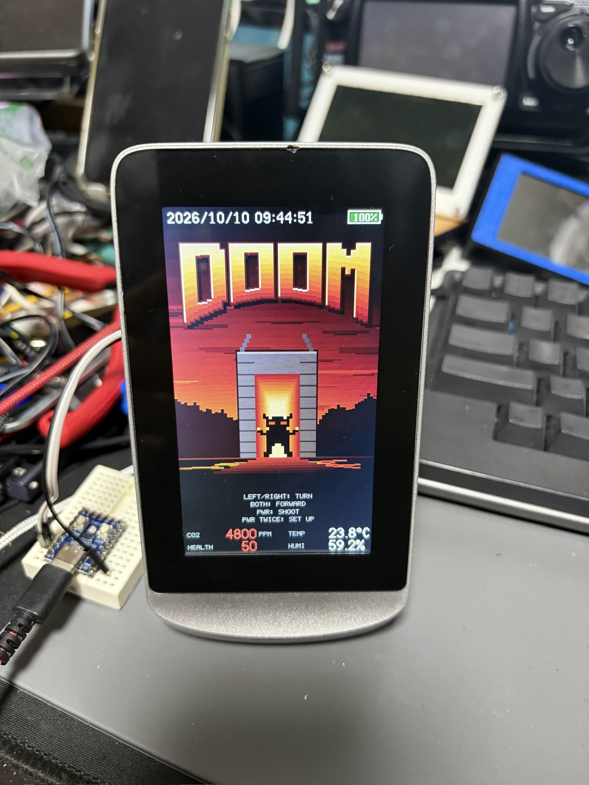
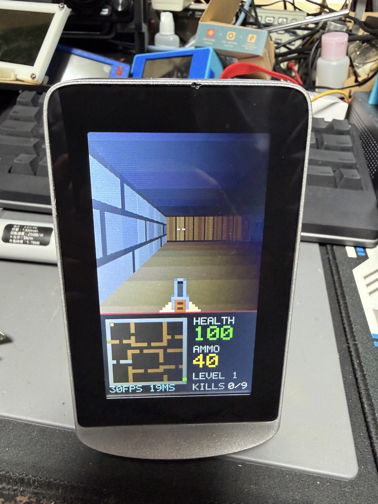

# DOOM on the DM72C board

| Title | Play |
|---|---|
|  |  |

A DOOM-style raycaster for the AT32F415 + LT7680B board. The screen is portrait (272 x 480): the 3D view on top, a status panel with a minimap below. Everything is drawn with the LT7680B's hardware rectangle fill, so a frame is a few hundred register writes instead of a full-screen pixel transfer.

## Controls

Left/right buttons turn, both together walk forward, PWR fires. On the title page PWR starts, PWR twice opens SET UP (clock). The title page shows the date, time and battery level at the top, and CO2, temperature and humidity at the bottom; the room's comfort sets the starting health. Details (in Japanese): [`../../doc/usage.md`](../../doc/usage.md).

Three levels. Imps throw fireballs, brutes bite at close range. Health and ammo boxes lie around. Walk into the green exit switch to finish a level.

## Rendering

- Walls: one fixed-point DDA ray per 2-pixel column. Each wall type has a 16 x 16 texture (`src/textures.c`); a column is drawn as one rectangle per vertical run of equal texels. The patterns are made of horizontal joints, and shades change only where a joint already splits a column, so a column needs about 3-7 rectangles. Walls lower than 32 px (texels under 2 px) are drawn as one flat rectangle. Brightness falls off with distance in steps of 1/16 so colours stay steady; side walls are darker.
- Floor and ceiling: horizontal bands of equal brightness (about 30 rectangles).
- Sprites: pixel art from `src/art.c`, scaled per texel column and clipped against the wall depth of each column. Each vertical run of one colour is one rectangle.
- Double buffering: two canvases in the LT7680B SDRAM (0x000000 and 0x080000). The finished canvas becomes the main window (REG20-23); the next frame is drawn into the other (REG50-53).
- The status panel is redrawn per buffer only when a value changes.

LT7680B geometry engine: REG68-6F start/end point, REGD2-D4 colour, REG76 = 0xE0 (start, fill, rectangle). The driver keeps a copy of these registers and skips writes that would not change them, and waits for STSR bit 3 (core busy) before each fill.

## Structure

| File | Role |
|---|---|
| `src/game.c` | Game logic at 30 Hz: player movement and wall sliding, hitscan, monster AI, fireballs, pickups, level flow |
| `src/render.c` | Raycasting, floor/ceiling bands, sprites, weapon, status panel, win page |
| `src/title.c` | Title page: DOOM-style logo, burning sky, mountains, gate with an imp |
| `src/levels.c` | The three 20 x 20 maps |
| `src/art.c` | Sprite art and palette |
| `src/textures.c` | 16 x 16 wall textures (stone, brick, tech, wood, exit switch) |
| `src/font.c` | 5 x 7 font drawn as rectangles |
| `src/digits.c`, `src/digits_big.inc` | Smooth digits for the status and sensor strips (`tools/gen_digits.py` makes the 32 and 16 px sets) |
| `src/setup.c` | SET UP page, date/time/battery strip, sensor strip |
| `src/rtc.c`, `src/swi2c.c` | PCF8563 on bit-banged I2C (PB0 SCL, PB1 SDA) |
| `src/sht3x.c` | SHT3x temperature/humidity (PB3 SCL, PB4 SDA), periodic mode, self-heating correction as in the factory firmware |
| `src/co2.c` | CO2 module on a 9600 baud software UART (PA0 TX, PA1 RX in an EXTI interrupt) |
| `src/battery.c` | Battery level from PA5 (ADC1 ch5), raw 2100-2400 mapped to 0-100 % |
| `src/gfx.h`, `src/gfx_lt.c` | Portrait rectangle API and double buffering on the LT7680B |
| `src/lt7680.c` | Driver from `../invaders`, plus hardware rectangle fill and buffer switching |
| `src/sound.c` | Buzzer effects on PA4 (TMR3 48 kHz, as in ALIEN RAID) |
| `src/board.c` | 144 MHz clock, PA7 power latch, buttons (from `../invaders`) |
| `src/main.c` | Power on/off, main loop, diagnostics (`g_diag`) |

## Host simulator

`tools/host_sim.c` builds the game with a software framebuffer, plays a scripted input sequence and writes frames as PPM. It also checks the map, texture and art row lengths.

```sh
cc -O2 -Isrc -o host_sim tools/host_sim.c src/game.c src/render.c src/title.c src/setup.c src/digits.c src/font.c src/levels.c src/art.c src/textures.c -lm
./host_sim OUTDIR        # walk through level 1
./host_sim OUTDIR 1      # stand in front of an imp and shoot it
./host_sim OUTDIR 2      # title page and SET UP
python3 tools/ppm2png.py OUTDIR/*.ppm
```

A frame needs about 220-700 rectangles in play (most when a near wall fills the view) The title page is about 2000 rectangles, so it is drawn once into each buffer; after that only the blinking PRESS SHOOT line and the top and bottom strips are redrawn.

## Flashing

Build with `pio run`, then flash `.pio/build/at32f415cbt7/firmware.elf` while halted, as in [`../../doc/flashing.md`](../../doc/flashing.md) (power, OpenOCD command; J1 wiring in [`../../doc/debugger_connection.md`](../../doc/debugger_connection.md)). Hold PWR while connecting: see the note at the end.

## Frame rate

The status panel shows `nnFPS nnMS` under the minimap, updated once per second: frames drawn in the last second (at most 30, one per game tick) and the slowest frame's draw time in ms. SWD memory reads fail while the game runs (see below), so this display is the way to measure it.

## Status (2026-10-09)

On hardware: title page, 3D view, textured walls, status panel, controls and sound work. With flat walls a frame took at most 15 ms; with textured walls at most 20 ms (close to a wall). The game keeps 30 fps.

2026-10-10: clock, battery, SET UP and the sensor strip work on hardware. The CO2 module (9600 baud) and the SHT3x give readings, and the starting health follows them (see the title photo above). Without a sensor the value shows `----`.

While the game runs, SWD fails to reach the core (the probe sees the DP, but memory access fails), as with the sflash firmware. Holding PWR makes it work: flash while PWR is held. The firmware stops counting the 5 s power-off press once it is halted.
