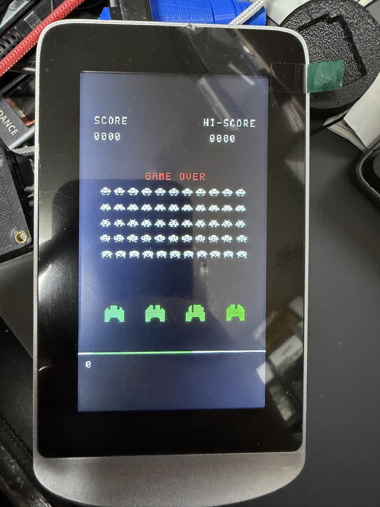

# ALIEN RAID on the DM72C board



Runs the invaders9k game (8080 code) on the AT32F415 with an 8080 emulator. The game is shown in portrait on the LT7680B-driven 480 x 272 panel, with per-object colors, anti-aliased scaling and Space-Invaders-style sound.

## Game ROM changes (`rom/`)

`rom/game.asm`, `rom/gen_gfx.py` and `rom/asm8080.py` are copies from `~/src/Gowin/invaders9k`. The original binary is kept as `rom/game_orig.bin`. Changes:

- Bold 7x7 arcade-style font (`FONT7` in `gen_gfx.py`).
- Nagoya attack: aliens may sit on the row just above the player. The game ends only when they reach the player row. That row does not drop bombs, as on the arcade original.

Rebuild:

```sh
cd rom && python3 gen_gfx.py && python3 asm8080.py game.asm -o game.bin --sym game.sym --lst game.lst
cd .. && python3 tools/bin2c.py rom/game.bin src/game_rom.c
```

## Controls

Left button = left, PWR = right, right button = fire / start. Hold PWR 1 s to power on, 5 s to power off. Details (in Japanese): [`../../doc/usage.md`](../../doc/usage.md).

At 5 s the PA7 latch is released. The board loses power when PWR is released: while PWR is held, the button itself keeps the supply on. The backlight cannot be switched off from the LT7680B. PWM1 had no effect on it. After the power-on hold, PWR is ignored as "right" until it is released.

## Structure

| File | Role |
|---|---|
| `src/i8080.c` | 8080 core, ported from `invaders9k/tools/emu8080.py` (same flags, cycles, EI delay, interrupt acceptance) |
| `src/machine.c` | Machine model: ROM/RAM/VRAM map, barrel shifter, RST 1/RST 2 at mid/end of each 33333-cycle frame |
| `src/game_rom.c` | Generated from `rom/game.bin` by `tools/bin2c.py` |
| `src/video.c` | Portrait rendering (272 x 358, arcade-like pixel aspect) with box-filter anti-aliasing in RGB565. Colors come from the game state (alien type, UFO, shots, bombs, explosions, text rows). Redraws VRAM cells whose pixels or color changed |
| `src/sound.c` | Passive buzzer on PA4: 48 kHz TMR3 interrupt, 4 voices OR-ed as pulse-width-controlled squares and gated LFSR noise. Fleet march (4 bass notes), UFO siren, shot, invader hit, UFO hit, player explosion, triggered from game RAM |
| `src/lt7680.c` | LT7680B driver: PA8 8 MHz XI clock, PLL/SDRAM/panel init, 16 bpp canvas. SPI mode and write speed are chosen by a self-test |
| `src/board.c` | 144 MHz clock, factory GPIO state, PA7 power latch, buttons |

`DISPLAY_ROTATION` in `video.c` rotates the picture by 180 degrees.

## Verification

- `tools/host_test.c` vs `tools/ref_run.py` (reference Python model): the first 300,000 instruction traces are identical, and RAM+VRAM are identical after 1,200, 4,000 and 12,000 frames with a scripted input.
- `tools/host_video.c`: after 400, 3,000 and 6,000 frames, incremental updates give the same panel image as a full redraw.

```sh
cc -O2 -DMACHINE_TRACE -o host_test tools/host_test.c src/machine.c src/i8080.c src/game_rom.c
cc -O2 -o host_video tools/host_video.c src/video.c src/machine.c src/i8080.c src/game_rom.c
```

- `tools/host_nagoya.c`: aliens stay on the row above the player for 632 frames before landing. With the original ROM, the game ends when they reach that row.

On hardware: SPI mode 0 at 18 MHz with burst writes. Emulation takes at most 6 ms per frame. Screen updates take a few ms, up to about 140 ms on full-screen clears.

## Serial flash (W25Q32) tool

The W25Q32 (JEDEC ID EF4016, 4 MB) sits on the LT7680B SPI master, chip select nSS1. It has no write protection (SR1 = 00, SR2 = 02 with QE = 1). The `sflash` environment is a small firmware that drives it through a RAM mailbox over SWD:

```sh
pio run -e sflash          # then flash .pio/build/sflash/firmware.elf (see Flashing)
python3 tools/sflash.py id
python3 tools/sflash.py read  out.bin [ADDR] [LEN]   # about 27 KB/s; 4 MB in 151 s
python3 tools/sflash.py write in.bin ADDR            # erase 4 KB sectors, program, verify
python3 tools/sflash.py erase4k ADDR
```

Back up the factory contents with `../../tools/backup_flash.py` first ([`../../doc/flash_backup.md`](../../doc/flash_backup.md)). The dump is not included in the repository (SHA256 of the author's unit: `5b130150…d705`). Only 0x000000-0x10FFFF is used, and the rest (about 2.9 MB) is blank. Write/erase was tested on the last sector (0x3FF000), which was then erased back to blank.

## Flashing

Flash `.pio/build/at32f415cbt7/firmware.elf` (or `.pio/build/sflash/firmware.elf`) while halted, with SysTick and the 48 kHz sound interrupt disabled, as in [`../../doc/flashing.md`](../../doc/flashing.md) (power, OpenOCD command; J1 wiring in [`../../doc/debugger_connection.md`](../../doc/debugger_connection.md)).

`g_diag` (`mdw &g_diag 9`) reports stage, frame count, worst-case emulation/video time, late frames and the LT7680B SPI settings.
